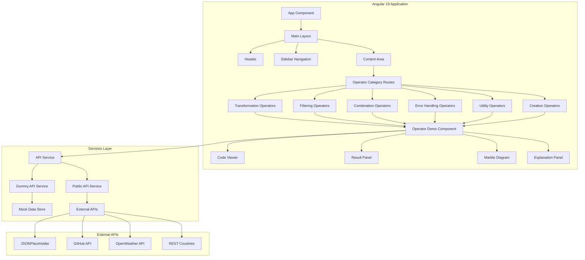
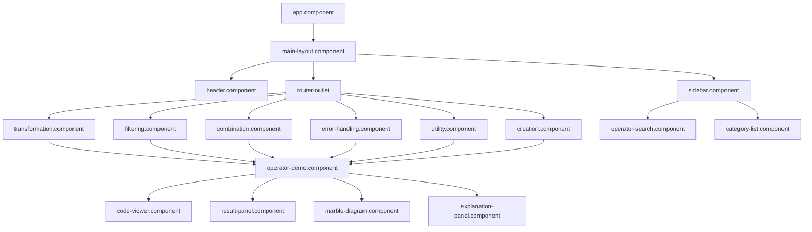
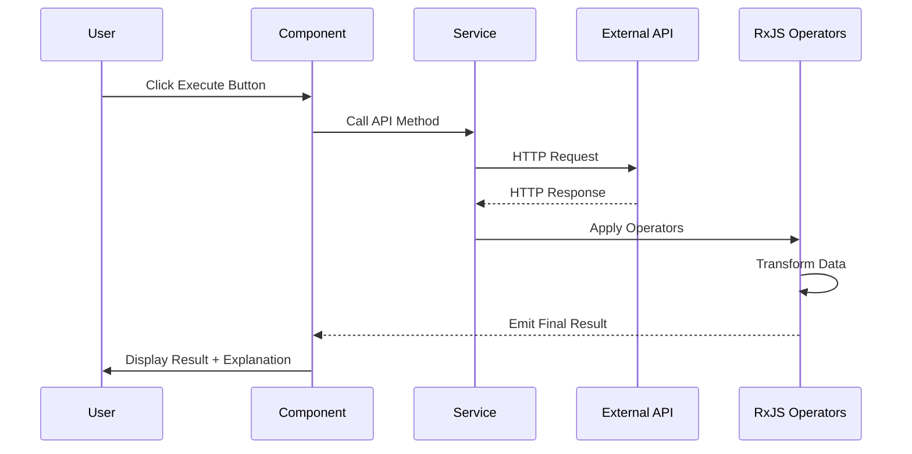
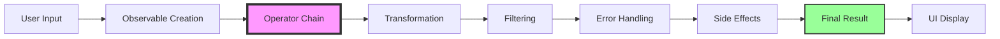
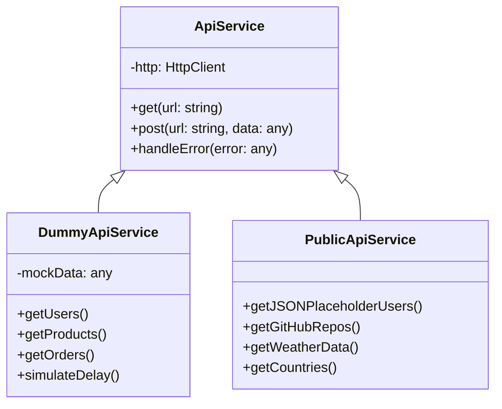
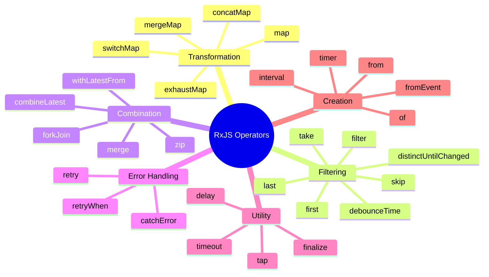
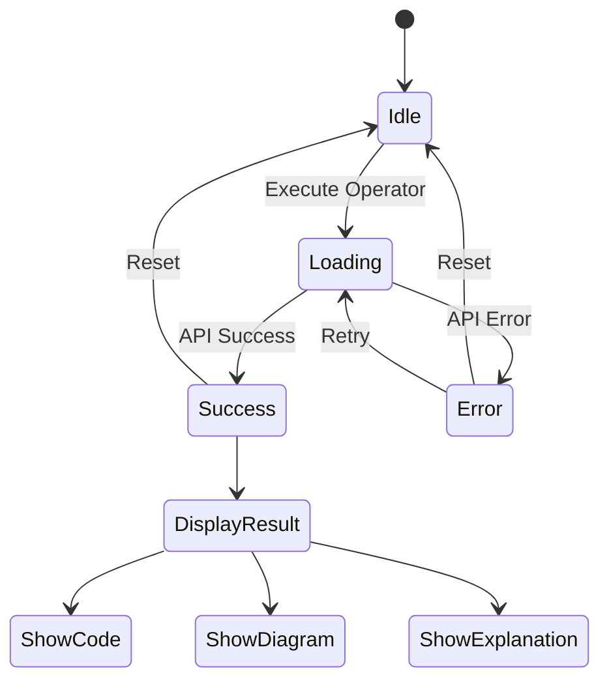
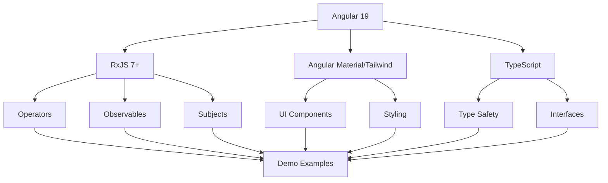

# RxJS Learning POC - Architecture

## System Architecture Overview



## Component Hierarchy



## Data Flow Architecture



## Operator Example Flow



## Service Architecture



## Operator Categories Structure



## State Management Flow



## Routing Structure

```
/
├── /transformation
│   ├── /map
│   ├── /switchMap
│   ├── /mergeMap
│   ├── /concatMap
│   └── /exhaustMap
├── /filtering
│   ├── /filter
│   ├── /debounceTime
│   ├── /distinctUntilChanged
│   ├── /take
│   └── /skip
├── /combination
│   ├── /forkJoin
│   ├── /combineLatest
│   ├── /merge
│   └── /zip
├── /error-handling
│   ├── /catchError
│   ├── /retry
│   └── /retryWhen
├── /utility
│   ├── /tap
│   ├── /delay
│   └── /finalize
└── /creation
    ├── /of
    ├── /from
    ├── /interval
    └── /timer
```

## Key Design Patterns

### 1. Service Pattern
- Centralized API logic
- Reusable across components
- Easy to test and mock

### 2. Component Pattern
- Standalone components (Angular 19)
- Reusable operator demo template
- Separation of concerns

### 3. Observable Pattern
- Reactive data flow
- Automatic cleanup
- Error handling built-in

### 4. Strategy Pattern
- Different operators for different scenarios
- Pluggable operator examples
- Easy to extend

## Technology Integration



## Performance Considerations

1. **Lazy Loading**: Load operator modules on demand
2. **Change Detection**: OnPush strategy for better performance
3. **Unsubscribe**: Automatic cleanup with async pipe
4. **Caching**: Cache API responses where appropriate
5. **Debouncing**: Prevent excessive API calls

## Security Considerations

1. **API Keys**: Store in environment files (not committed)
2. **CORS**: Handle cross-origin requests properly
3. **Input Validation**: Sanitize user inputs
4. **Error Messages**: Don't expose sensitive information

---

This architecture ensures:
- ✅ Scalability - Easy to add new operators
- ✅ Maintainability - Clear separation of concerns
- ✅ Testability - Services and components are testable
- ✅ Reusability - Shared components across examples
- ✅ Learning - Clear structure for understanding